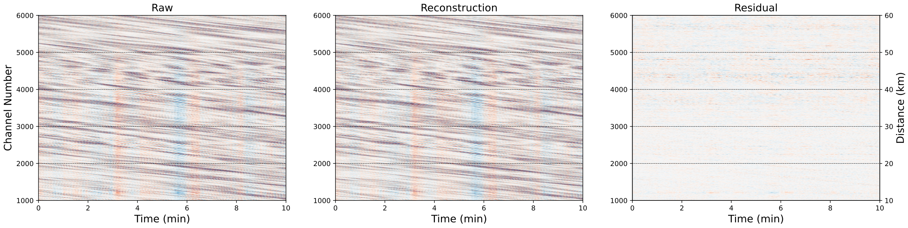
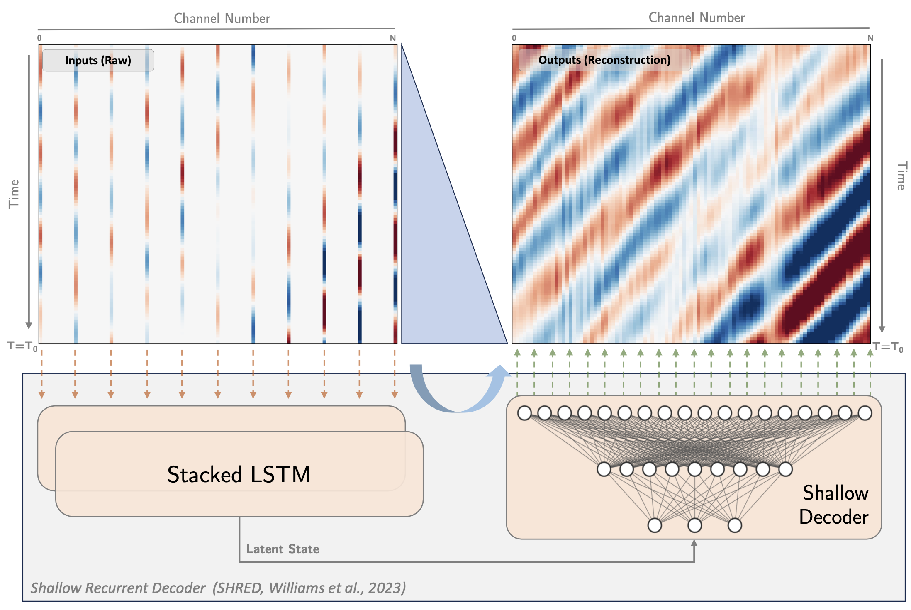

# Distributed Acoustic Sensing Compression and Wavefield Reconstruction with Deep Learning

This study explores wavefield reconstruction using machine learning methods for data compression and wavefield separation. We test various architectures to treat DAS data as two-dimensional arrays, such as the `Implicit Neural Representation` (INR) models and the `SHallow REcurrent Decoder` (SHRED) model.

## Tutorials
All codes are implemented in PyTorch.

- SHallow REcurrent Decoder (SHRED, [Williams et al., 2023](https://arxiv.org/abs/2301.12011)): [notebooks/SHRED_KKFLS_training.ipynb](./notebooks/SHRED_KKFLS_training.ipynb)

#### Implicit Neural Representation (INR)

- Random Fourier Feature Network (RFFN, [Tancik et al., 2020](https://arxiv.org/abs/2006.10739)): [notebooks/RFFN_KKFLS_training.ipynb](./notebooks/RFFN_KKFLS_training.ipynb)
- Sinusoidal Representation Network (SIREN, [Sitzmann et al., 2020](https://arxiv.org/abs/2006.09661)): [notebooks/SIREN_KKFLS_training.ipynb](./notebooks/SIREN_KKFLS_training.ipynb)

## Data
The earthquake data from the Cook Inlet DAS experiment are available at [https://dasway.ess.washington.edu/gci/index.html](https://dasway.ess.washington.edu/gci/index.html). Events are updated daily.

Due to the huge size of the data used in this study, we cannot upload it directly in this repository. However, we prepared a Python script to download these data from our archival server. Please refer to [download.py](./data/download.py) in this directory.

## Notes
Comments and sugguestions are welcomed. Please report all issues under this repository.