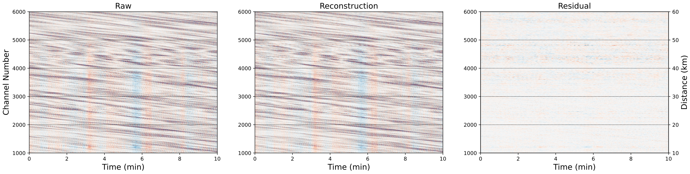
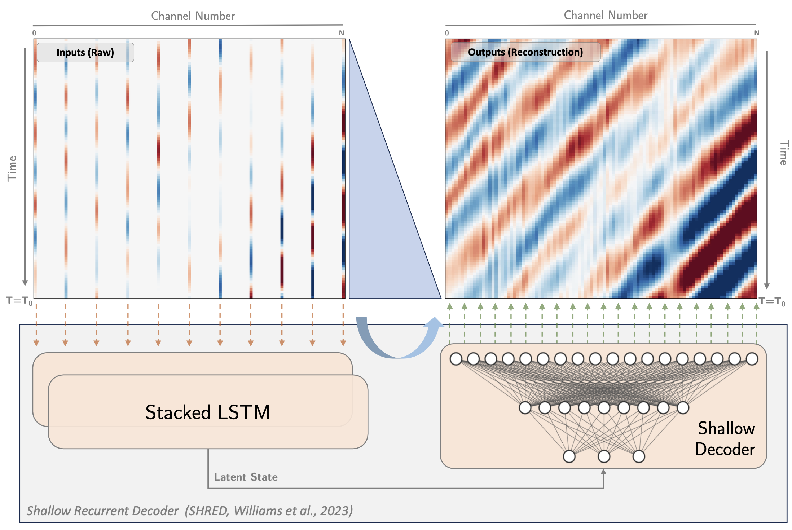
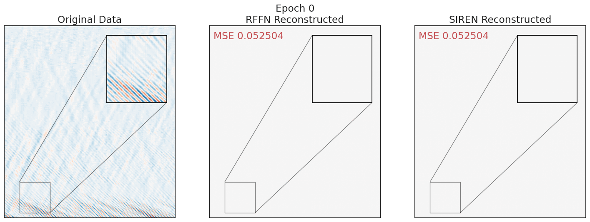

# Wavefield Reconstruction of Distributed Acoustic Sensing with Machine Learning

This study explores wavefield reconstruction using machine learning methods for data compression and wavefield separation. We test various architectures to treat DAS data as two-dimensional arrays, such as the `Implicit Neural Representation` (INR) models and the `SHallow REcurrent Decoder` (SHRED) model.

## Tutorials
This repository provides independent notebook examples of model training and inference performed in the manuscript. All codes are implemented in PyTorch.

### SHallow REcurrent Decoder
The notebook of SHRED model training is available at [notebooks/SHRED_KKFLS_training.ipynb](./notebooks/SHRED_KKFLS_training.ipynb). See below for instructions of getting the training data. 

### Implicit Neural Representation

- Random Fourier Feature Network (RFFN, [Tancik et al., 2020](https://arxiv.org/abs/2006.10739)): [notebooks/RFFN_KKFLS_training.ipynb](./notebooks/RFFN_KKFLS_training.ipynb)
- Sinusoidal Representation Network (SIREN, [Sitzmann et al., 2020](https://arxiv.org/abs/2006.09661)): [notebooks/SIREN_KKFLS_training.ipynb](./notebooks/SIREN_KKFLS_training.ipynb)

## Data
The earthquake data from the Cook Inlet DAS experiment are available at [https://dasway.ess.washington.edu/gci/index.html](https://dasway.ess.washington.edu/gci/index.html). Earthquakes and daily data reports will be updated daily.

Due to the size of the data used in this study (~260 GB per cable), we cannot upload it directly in this repository. However, we prepared a Python script to download these data from our archival server. Please refer to the script [download.py](./data/download.py) and list of events [event_list.csv](./data/event_list.csv) in the repository.

## Reference
Ni, Y., Denolle, M. A., Shi, Q., Lipovsky, B. P., Pan, S., & Kutz, J. N. (2024). Wavefield Reconstruction of Distributed Acoustic Sensing: Lossy Compression, Wavefield Separation, and Edge Computing. Journal of Geophysical Research: Machine Learning and Computation, accepted.