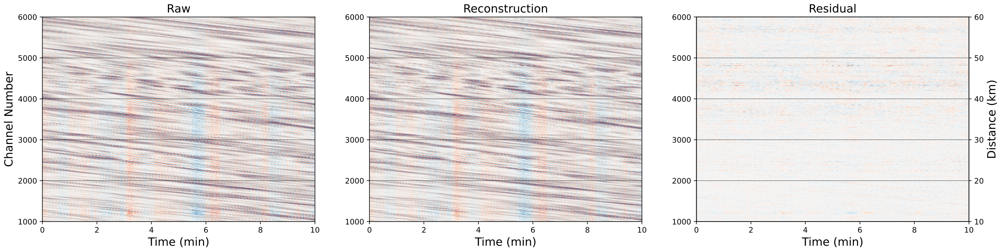
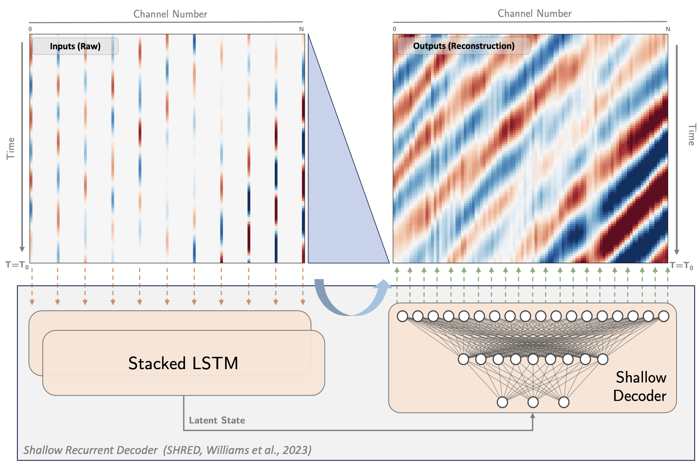
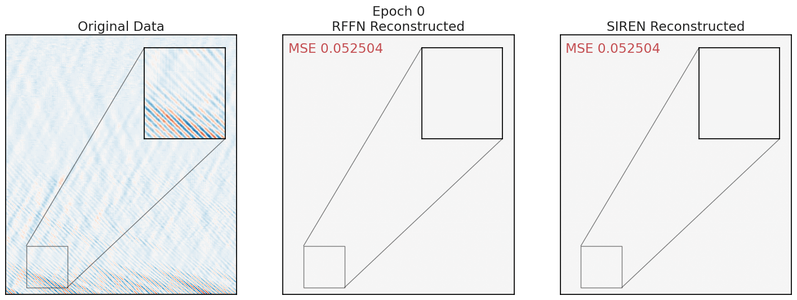
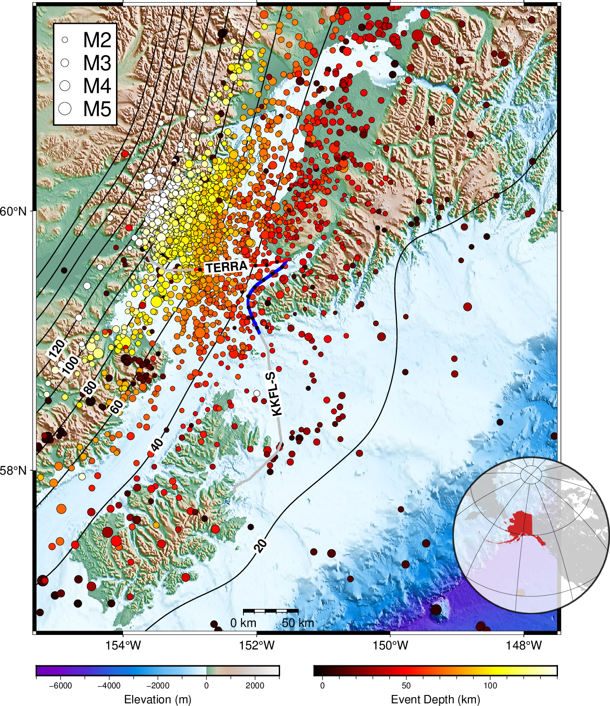

# Wavefield Reconstruction of Distributed Acoustic Sensing with SHallow REcurrent Decode
[](https://www.gnu.org/licenses/gpl-3.0)

This study explores wavefield reconstruction using machine learning methods for data compression and wavefield separation. We test various architectures to treat DAS data as two-dimensional arrays, including the `Implicit Neural Representation` (INR) models and the `SHallow REcurrent Decoder` (SHRED) model.


## Tutorials
This repository provides independent notebook examples of model training and inference performed in the manuscript. All codes are implemented using PyTorch.

### SHallow REcurrent Decoder
Notebooks of SHRED model [inference](./notebooks/tutorial_SHRED_KKFLS.ipynb) and [training](./notebooks/training_SHRED_KKFLS.ipynb) on the Cook Inlet DAS data are available. The model training notebook is available. See below for instructions of getting the training data. 


### Implicit Neural Representation

- Random Fourier Feature Network (RFFN, [Tancik et al., 2020](https://arxiv.org/abs/2006.10739)): [notebooks/training_RFFN_KKFLS.ipynb](./notebooks/training_RFFN_KKFLS.ipynb)
- Sinusoidal Representation Network (SIREN, [Sitzmann et al., 2020](https://arxiv.org/abs/2006.09661)): [notebooks/training_SIREN_KKFLS.ipynb](./notebooks/training_SIREN_KKFLS.ipynb)

## Cook Inlet DAS Data
The earthquake data from the Cook Inlet DAS experiment are hosted [here](https://dasway.ess.washington.edu/gci). Earthquakes and daily data reports are updated daily.



Due to the size of the data used in this study (~260 GB per cable), they are not uploaded directly in this repository. However, a Python script is available to download these data from our archival server. Please refer to the script [download.py](./data/download.py) and list of events [event_list.csv](./data/event_list.csv).

## Reference
Ni, Y., Denolle, M. A., Shi, Q., Lipovsky, B. P., Pan, S., & Kutz, J. N. (2024). Wavefield Reconstruction of Distributed Acoustic Sensing: Lossy Compression, Wavefield Separation, and Edge Computing. _Journal of Geophysical Research: Machine Learning and Computation_, 1(3), e2024JH000247. [10.1029/2024JH000247](https://doi.org/10.1029/2024JH000247)

```bibtex
@article{ni2024wavefield,
    title={Wavefield reconstruction of distributed acoustic sensing: Lossy compression, wavefield separation, and edge computing},
    author={Ni, Yiyu and Denolle, Marine A and Shi, Qibin and Lipovsky, Bradley P and Pan, Shaowu and Kutz, J Nathan},
    journal={Journal of Geophysical Research: Machine Learning and Computation},
    volume={1},
    number={3},
    pages={e2024JH000247},
    year={2024},
    publisher={Wiley Online Library},
    doi={10.1029/2024JH000247}
}
```